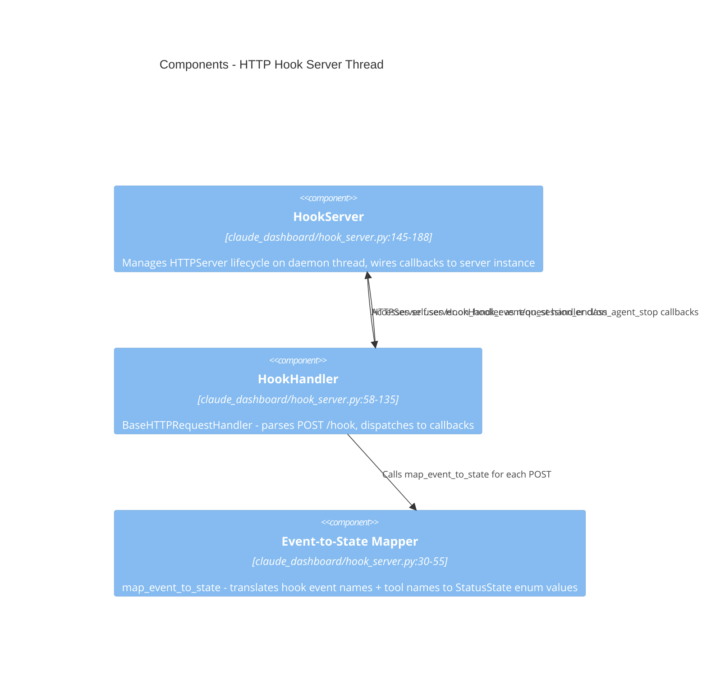
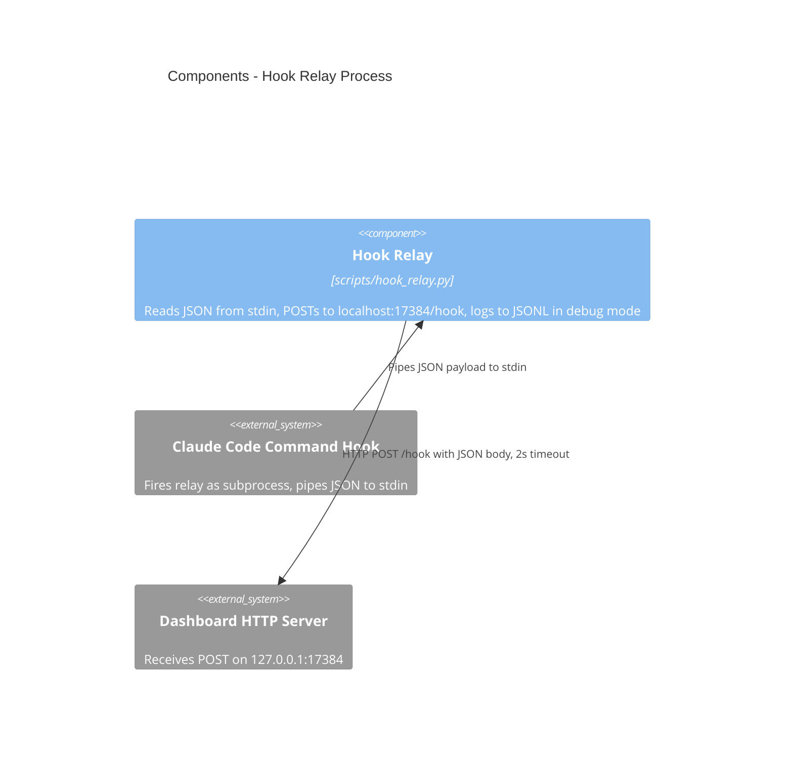

# C4 Component — Claude Dashboard

> Mermaid C4 may not render in all viewers.

## Tkinter Main Thread — Components

```mermaid
C4Component
    title Components - Tkinter Main Thread

    Component(controller, "AppController", "claude_dashboard/controller.py", "Central orchestrator - session lifecycle, hook wiring, UI coordination, settings, state persistence")
    Component(main_window, "MainWindow", "claude_dashboard/ui/main_window.py", "Borderless Tkinter window with title bar, session rows, drag, resize, shade toggle")
    Component(settings_window, "SettingsWindow", "claude_dashboard/ui/settings_window.py", "Modal dialog for editing all user-configurable settings with color pickers")
    Component(color_picker, "ColorPickerDialog", "claude_dashboard/ui/color_picker.py", "Custom color picker with palette grid, hex entry, live preview")
    Component(cost_popup, "CostPopup", "claude_dashboard/ui/cost_popup.py", "Dismissable popup showing 14-day cost history with bar chart")
    Component(session_discovery, "Session Discovery", "claude_dashboard/session.py", "Reads session files, validates PIDs, detects git branch/status/merge/upstream")
    Component(platform_adapter, "Platform Adapter", "claude_dashboard/platform/", "Container detection and window foregrounding - dispatches to windows.py or linux.py")
    Component(settings_io, "Settings I/O", "claude_dashboard/settings.py", "Settings dataclass with JSON load/save, type validation, atomic writes")
    Component(config, "Config", "claude_dashboard/config.py", "Constants, enums - StatusState, GitStatus, paths, defaults, platform flags")
    Component(models, "Models", "claude_dashboard/models.py", "SessionRow NamedTuple - data transfer from controller to UI")
    Component(startup, "Startup", "claude_dashboard/startup.py", "OS auto-start registration - Windows Registry or XDG .desktop")
    Component(file_utils, "File Utils", "claude_dashboard/file_utils.py", "atomic_write_json - tempfile + rename pattern")
    Component(tray_module, "Tray Module", "claude_dashboard/tray.py", "Creates pystray icon, generates eye-shaped PIL images, dynamic menu builder")

    Rel(controller, main_window, "Creates with callbacks, calls update_sessions and update_title_bar")
    Rel(controller, session_discovery, "discover_sessions, validate_pid, detect_branch/git_status/merged/upstream")
    Rel(controller, platform_adapter, "detect_container, find_window_for_session, foreground_window")
    Rel(controller, settings_io, "load_settings, save_settings")
    Rel(controller, startup, "set_run_on_startup on init and settings change")
    Rel(controller, tray_module, "create_tray_icon, update_tray_icon")
    Rel(controller, file_utils, "atomic_write_json for session-state.json")
    Rel(controller, config, "Reads paths, enums, defaults, platform flags")
    Rel(main_window, models, "Receives list of SessionRow for rendering")
    Rel(main_window, config, "Reads color defaults, emoji paths, platform flags")
    Rel(main_window, tray_module, "generate_icon_image for row flag icons")
    Rel(settings_window, color_picker, "Opens for each color setting field")
    Rel(settings_io, file_utils, "atomic_write_json for settings.json")
    Rel(settings_io, config, "Reads SETTINGS_FILE path and all DEFAULT_* constants")
```

## HTTP Hook Server Thread — Components

## Hook Relay — Components

## Event-to-State Mapping

| Hook Event | tool_name | agent_id | Mapped State |
|-----------|-----------|----------|-------------|
| `PreToolUse` | `AskUserQuestion` | any | `AWAITING_INPUT` |
| `PreToolUse` | any other | any | `WORKING` |
| `PermissionRequest` | `AskUserQuestion` | any | `AWAITING_INPUT` |
| `PermissionRequest` | any other | any | `PERMISSION_REQUIRED` |
| `UserPromptSubmit` | N/A | any | `WORKING` |
| `PostToolUse` | N/A | any | `WORKING` |
| `PostToolUseFailure` | N/A | any | `WORKING` |
| `Stop` | N/A | any | `IDLE` |
| `StopFailure` | N/A | any | `IDLE` |
| `SubagentStop` | N/A | yes | Not mapped (signals agent removal) |
| `SessionEnd` | N/A | N/A | Not mapped (signals session end) |
| Any unmapped event | N/A | yes (agent) | `WORKING` (registers agent) |
| Any unmapped event | N/A | no (main) | `None` (ignored) |

**Controller-level state overrides** (applied after mapping, main process only):

| Mapped State | Prior State | Event | Result |
|-------------|------------|-------|--------|
| `IDLE` | any | any | Intercepted to `READY` (`controller.py:672-673`) |
| `WORKING` | `PERMISSION_REQUIRED` | `PostToolUseFailure` | Suppressed — state remains `PERMISSION_REQUIRED` (`controller.py:679-691`) |
| same as prior | any | any | Suppressed — no UI refresh (`controller.py:675-676`) |

## State Priority (highest to lowest)

| Priority | State | Tray icon eligible |
|----------|-------|--------------------|
| 0 | `PERMISSION_REQUIRED` | Yes (actionable) |
| 1 | `AWAITING_INPUT` | Yes (actionable) |
| 2 | `WORKING` | No |
| 3 | `READY` | Yes (actionable) |
| 4 | `IDLE` | Yes (actionable) |

The tray icon reflects the highest-priority *actionable* state across all non-hidden, non-ghost sessions. `WORKING` is not actionable.

## Agent State Model

Each session tracks zero or more agents in `entry.agents: dict[str, _AgentEntry]`.

- **Effective state** of a session = highest-priority state across main process + all agents (`_SessionEntry.effective_state`, `controller.py:156-165`).
- **Agent registration:** Any hook event with `agent_id` (except `SubagentStop`) registers or updates the agent.
- **Agent removal:** `SubagentStop` event removes the agent from the dict.
- **Agent permission debounce:** When an agent enters `PERMISSION_REQUIRED`, a 5-second timer starts. If still pending after 5s, the UI updates. Non-permission events for that agent cancel the timer immediately. Main process permission events are never debounced.
- **Agent lifecycle on session death:** When a session's PID dies, the entire session (including agents) is removed and replaced with a ghost. Agents are not individually cleaned up — they go with the session.

## Git Status Detection

Priority order (first match wins, `session.py:140-176`):

| Check | Git Status | Eye Color Setting |
|-------|-----------|------------------|
| `git status --porcelain` has entries with non-space in column 2 | `UNSTAGED_CHANGES` | `color_flag_unstaged` |
| `git status --porcelain` has entries with non-space in column 1 | `STAGED_UNCOMMITTED` | `color_flag_staged` |
| `git log @{u}..HEAD` or `git log <trunk>..HEAD` has output | `COMMITTED_NOT_PUSHED` | `color_flag_unpushed` |
| Branch is not trunk (non-empty after `detect_branch`) | `PUSHED_NOT_MERGED` | `color_flag_unmerged` |
| All else | `CLEAN` | No eye icon (transparent) |

## Merged Branch Detection

Three strategies checked in order (`session.py:215-264`):

1. **Ancestor check:** `git merge-base --is-ancestor <branch> <trunk>` — detects regular merges
2. **Cherry check:** `git cherry <trunk> <branch>` — detects rebase merges (all commits have patch-equivalent in trunk)
3. **Diff check:** `git diff --quiet <trunk> <branch> --` — detects squash merges (tree identical to trunk)

Trunk ref is resolved dynamically from `<remote>/HEAD` via `git symbolic-ref` — no hardcoded branch names.

## Cross-Module Data Flow Summary

| Producer | Data | Consumer | Transformation |
|----------|------|----------|---------------|
| `hook_server.map_event_to_state` | `StatusState.IDLE` | `controller._apply_hook_state` | Intercepted to `READY` for main process events |
| `session.discover_sessions` | `list[SessionInfo]` | `controller._discovery_tick` | Filtered by `validate_pid`, matched against `_sessions` dict |
| `session.detect_git_status` | `GitStatus` enum | `controller._discovery_tick` | Stored in `_SessionEntry.git_status`, skipped if detection takes >0.5s |
| `controller._do_refresh_ui` | `list[SessionRow]` | `main_window.update_sessions` | NamedTuple projection from `_SessionEntry` — includes `effective_state` (agent-aware) |
| `settings.load_settings` | `Settings` dataclass | `controller.__init__` | Used directly; invalid fields silently replaced with defaults |
| `controller._save_session_state` | `dict[cwd, state_dict]` | `controller._load_session_state` (next run) | Keyed by CWD; duplicate-CWD sessions merge (hidden only if ALL hidden) |
| `tray.generate_icon_image` | `PIL.Image` | `main_window._flag_icon` | Reused by main_window for row eye icons (not just tray) |
| `config.hex_to_rgb` | `(r,g,b)` tuple | `tray.generate_icon_image`, `main_window` | Shared utility for color conversion |

## Platform-Conditional Behavior Summary

| Behavior | Windows | Linux |
|----------|---------|-------|
| **DPI awareness** | `ctypes.windll.shcore.SetProcessDpiAwareness(1)` at startup | Not needed |
| **Window type** | `overrideredirect(True)` — frameless | `wm_attributes("-type", "dock")` — Wayland-compatible, visible on all workspaces |
| **Container detection** | Walk parent chain via psutil, match Code.exe/WindowsTerminal.exe/mintty.exe | Walk parent chain via psutil, match code/terminal emulators/screen/tmux |
| **Window matching** | Win32 `EnumWindows` + `GetWindowTextW`, match CWD folder name in title | Not done at discovery time — happens at foreground time |
| **Window foregrounding** | `SetForegroundWindow(hwnd)` with Alt-key fallback | VS Code: `code <cwd>` CLI. Terminals: `gdbus call` to window-calls D-Bus extension |
| **Auto-start** | `HKCU\Software\Microsoft\Windows\CurrentVersion\Run` registry key | `~/.config/autostart/claude-dashboard.desktop` XDG file |
| **Startup command** | `pythonw.exe -m claude_dashboard --debug --log-file <path>` | `python -m claude_dashboard --debug --log-file <path>` |
| **Subprocess flags** | `CREATE_NO_WINDOW` (prevents console flash) | `0` |
| **Font family** | `Segoe UI` / `Segoe UI Emoji` | `Noto Sans` / `Noto Emoji` |
| **Settings path** | `%APPDATA%/claude-dashboard/settings.json` | `~/.config/claude-dashboard/settings.json` |
| **Popup window type** | `overrideredirect(True)` | `wm_attributes("-type", "dock")` |
