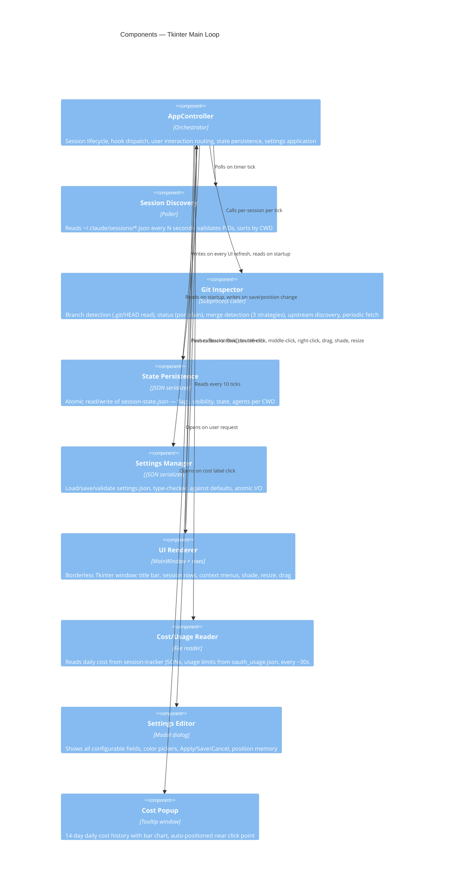
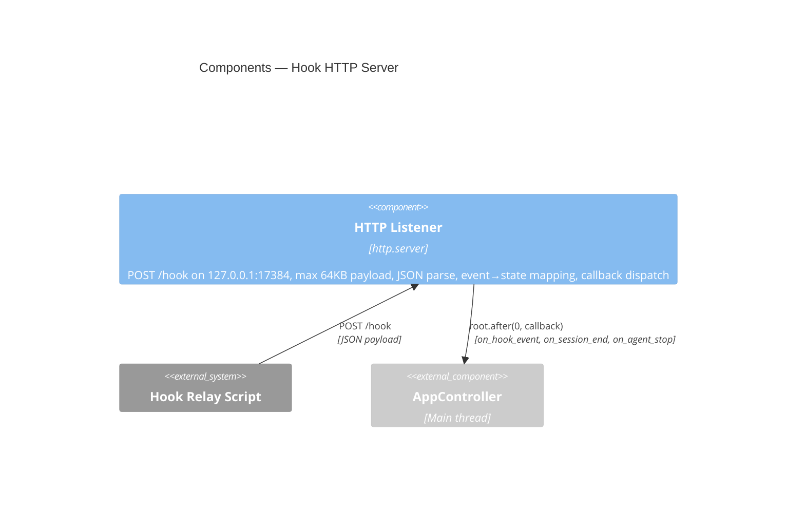
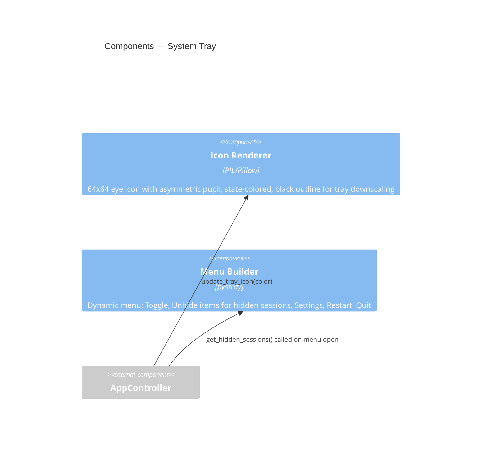
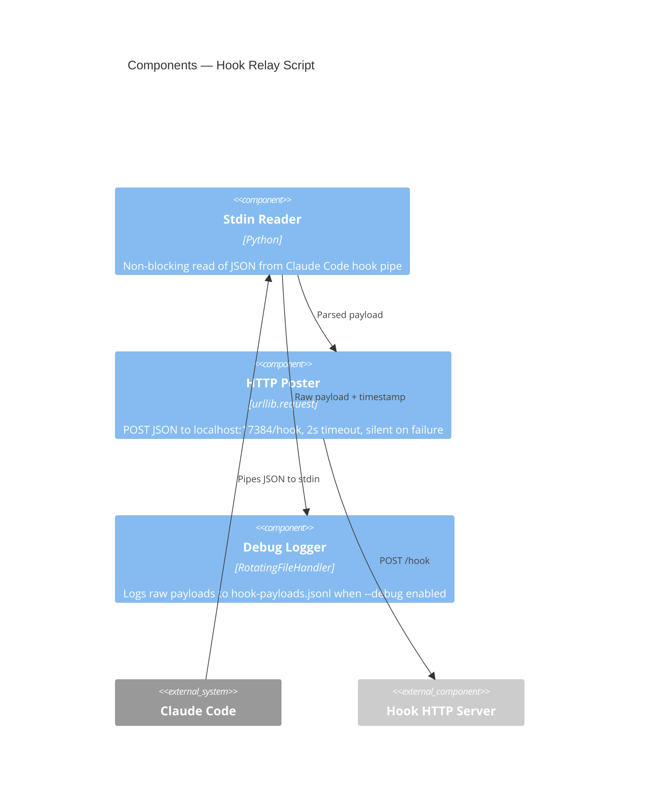
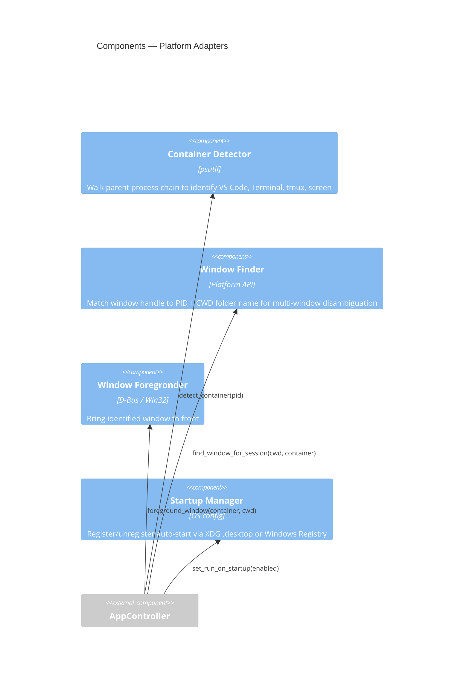

# C4 Component Diagram — Claude Dashboard

## Component View (Level 3)

Decomposes each container into its behavioral components: what each does, what it talks to, and what data it owns.

---

## Container: Tkinter Main Loop

The main thread owns all mutable state. Every other thread dispatches work here via `root.after(0, fn)`.



### Component: AppController

The central orchestrator. Owns the session map (`_sessions: dict[int, _SessionEntry]`), reverse lookup (`_session_id_to_pid`), and all lifecycle logic.

**Responsibilities:**
- Register new sessions from discovery
- Convert dead sessions to ghosts
- Route hook events to session entries (main process or agent)
- Handle user interactions (clicks, context menus)
- Coordinate UI refresh with debouncing
- Manage tray icon state
- Apply settings changes
- Handle restart (state save → `os.execv`) and quit

**State owned:**
- `_sessions` — all tracked sessions (live + ghost)
- `_session_id_to_pid` — reverse lookup for hook routing
- `_pending_hook_states` — buffer for events before session discovery
- `_trunk_cache` — cached trunk branch per CWD (cleared each tick)
- `_agent_perm_debounce` — pending debounce timers per agent
- `_ghosts_hidden` — global ghost visibility toggle
- `_daily_cost`, `_usage_limits` — title bar data

### Component: Session Discovery

Reads `~/.claude/sessions/*.json` and returns validated `SessionInfo` objects.

**Behavior:**
- Glob `*.json` files in sessions directory
- Parse each: extract `pid`, `sessionId`, `cwd`, `startedAt`, `entrypoint`
- Validate PID: `psutil.pid_exists()` + process name contains "claude"
- Sort alphabetically by CWD relative to home
- Return list; controller handles add/remove/ghost logic

### Component: Git Inspector

All git operations are **read-only** with **2-second timeouts** (10s for fetch). Failures degrade to CLEAN status.

**Branch detection:** Reads `.git/HEAD` file directly (no subprocess). Returns empty string if on trunk or detached.

**Status detection** (priority order):
1. `git status --porcelain` → UNSTAGED_CHANGES or STAGED_UNCOMMITTED
2. `git log @{u}..HEAD` → COMMITTED_NOT_PUSHED (has upstream tracking)
3. `git log <trunk_ref>..HEAD` → COMMITTED_NOT_PUSHED (fallback to trunk)
4. Non-trunk branch with no unpushed commits → PUSHED_NOT_MERGED
5. Otherwise → CLEAN

**Merge detection** (three strategies):
1. `git merge-base --is-ancestor <branch> <trunk>` — regular merge
2. `git cherry <trunk> <branch>` — rebase merge (all commits have patch-equivalent)
3. `git diff --quiet <trunk> <branch>` — squash merge (trees identical)

**Upstream discovery:** `git remote` → `git symbolic-ref refs/remotes/<remote>/HEAD` per remote.

**Periodic fetch:** Every ~60s, runs `git fetch <remote>` for PUSHED_NOT_MERGED sessions (10s timeout).

### Component: State Persistence

**Session state file:** `~/.claude/claude-dashboard/session-state.json`

Written atomically (temp file + rename) on every UI refresh. Read once on startup.

**Per-CWD entry:**
```json
{
  "state": "ready",
  "hidden": false,
  "flagged": true,
  "agents": { "agent-id": { "state": "working", "agent_type": "..." } }
}
```

**Multi-session merge:** When multiple sessions share a CWD, `hidden` is only true if ALL sessions are hidden. Agents are merged.

**Restore behavior:** On first tick, creates ghost entries for CWDs in saved state that have no live session.

### Component: Settings Manager

**File:** Platform-specific path (Linux: `~/.config/claude-dashboard/settings.json`, Windows: `AppData`)

**Validation:** Filters unknown fields, type-checks against defaults (rejects bool for int), skips invalid entries.

**Settings fields** (27 total):
- Window geometry: `window_x`, `window_y`, `settings_x/y`, `color_picker_x/y`
- Behavior: `always_on_top`, `grow_up`, `run_on_startup`
- Layout: `row_height`, `row_width`, `font_size`, `poll_interval_seconds`
- Colors: 12 hex color fields (5 status states, 5 flag states, unattached, window_bg)
- Text: `text_color` (exists but unused — auto-contrast computes this)
- Filtering: `ignore_regex` (Python regex matched against CWD)

### Component: UI Renderer (MainWindow)

**Window type:**
- Linux: `_NET_WM_WINDOW_TYPE_DOCK` (visible on all workspaces, no decorations)
- Windows: `overrideredirect(True)` (borderless)

**Title bar content** (left to right):
- Eye icon (green when expanded, transparent when shaded)
- Chef's kiss emoji (PNG or unicode fallback)
- "Claude Dashboard" text
- Session counts: `{active}` `(+hidden_live)` `[+hidden_ghost]`
- Daily cost: `$X.XX`
- 5h usage: `5h: X%`
- 7d usage: `7d: X%`

**Row content** (left to right):
- Eye/flag icon (outer = git status color, pupil = manual flag color)
- Status emoji (per state)
- CWD path (relative to home, "git-worktrees/" shortened to ".../")
- Agent count `(+N)` suffix
- Branch `[name]` (red if merged)
- Container label (right-aligned, dim: "VS Code", "Term", etc.)

**Text color:** Auto-contrasted — W3C sRGB luminance formula. Light text (`#f5f0e8`) on dark backgrounds, dark text (`#1a1520`) on light.

**Geometry management:**
- Position tracked independently (avoids stale `winfo_x/y` on Wayland)
- Grow-up mode: anchors bottom edge, window grows upward
- Shade: collapses to title bar only; title bar background = highest-priority state color (excludes "ready")
- Width resize: drag cost labels horizontally (min 150px, persisted)

### Component: Cost Popup

**Behavior:** Shows 14-day daily cost breakdown in a tooltip window. Positioned near click point, adjusted to stay on-screen. Dismisses on mouse leave.

**Data source:** Reads `~/.claude/my-claude-stuff-data/session-tracker/{YYYY-MM-DD}/*.json` for the last 14 days.

---

## Container: Hook HTTP Server

Single component — the HTTP listener.



**Event routing:**
- Events with `agent_id` → agent state update (register or update)
- Events without `agent_id` → main process state update
- `SubagentStop` → agent removal (separate callback)
- `SessionEnd` → ghost conversion (separate callback)

**Event-to-state mapping:**

| Event | State | Condition |
|-------|-------|-----------|
| UserPromptSubmit | WORKING | — |
| PreToolUse | WORKING | Default |
| PreToolUse | AWAITING_INPUT | tool_name = "AskUserQuestion" |
| PostToolUse | WORKING | — |
| PostToolUseFailure | WORKING | — |
| PermissionRequest | PERMISSION_REQUIRED | Default |
| PermissionRequest | AWAITING_INPUT | tool_name = "AskUserQuestion" |
| Stop | IDLE | (Controller intercepts → READY) |
| StopFailure | IDLE | (Controller intercepts → READY) |
| SubagentStart | WORKING | Registers agent |
| SubagentStop | (none) | Removes agent |
| SessionEnd | (none) | Converts to ghost |

---

## Container: System Tray



**Icon design:** Eye shape with offset pupil (looking slightly right). Outer circle = state color. Black outline prevents color bleed at small sizes. Threshold alpha eliminates semi-transparent edges.

**Color mapping:** Highest-priority *actionable* state across all visible sessions. Working is excluded — tray only reflects states needing user action (permission, awaiting input, ready, idle).

**Menu items:**
- "Toggle" — show/hide main window (default left-click action)
- Per-hidden-session "Unhide: {CWD}" items (dynamic)
- "Settings", "Restart", "Quit"

---

## Container: Hook Relay Script



**Lifecycle:** Invoked per-event by Claude Code. Reads stdin, POSTs, exits. No state, no return channel.

**Flags:**
- `--debug` — enable payload logging (always on in hooks-settings.json)
- `--marker TEXT` — log a boundary line and exit (debugging aid)

---

## Container: Platform Adapters



**Container detection:** Walks parent PID chain looking for known process names:
- VS Code: `code` (Linux), `code.exe` (Windows)
- Terminal: gnome-terminal, konsole, alacritty, kitty, wezterm, ghostty, etc.
- Multiplexers: tmux, screen
- Windows-specific: Windows Terminal (`wt.exe`), cmd.exe, Git Bash (`mintty.exe`)

**Window foregrounding (Linux):**
- VS Code: `code <cwd>` CLI (most reliable on Wayland)
- Terminal: D-Bus `window-calls` GNOME Shell extension (Wayland-native)
  - List windows → match by PID → Activate window ID
  - Multi-window VS Code: disambiguate by CWD folder name in window title

**Window foregrounding (Windows):**
- Find main VS Code PID (parent is NOT Code.exe)
- Enumerate visible windows owned by that PID
- Match by CWD folder name in title
- `SetForegroundWindow` + Alt-key trick for focus stealing
- Restore minimized windows first

---

## Data Flow Summary

```
Hook Relay ──POST──▶ Hook Server ──after(0)──▶ AppController
                                                    │
Session Discovery ──poll──▶ AppController           │
                                │                   │
                           ┌────┴────┐         ┌────┴────┐
                           │ Git     │         │ State   │
                           │Inspector│         │Persist  │
                           └─────────┘         └─────────┘
                                │                   │
                           ┌────┴───────────────────┴────┐
                           │     UI Renderer             │
                           │  (MainWindow + rows)        │
                           └────┬───────────────────┬────┘
                                │                   │
                           ┌────┴────┐         ┌────┴────┐
                           │ Tray    │         │ Platform│
                           │ Icon    │         │ Adapter │
                           └─────────┘         └─────────┘
```
