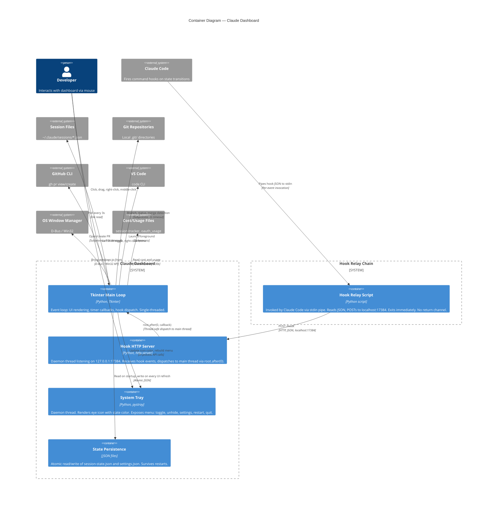

# C4 Container Diagram — Claude Dashboard

## Container View (Level 2)

Zooms into the "Claude Dashboard" system boundary to show the major runtime containers (processes, threads, scripts) and how they communicate.



## Container Descriptions

### Hook Relay Script
- **Runtime**: Separate Python process, invoked per-event by Claude Code's hook system
- **Lifecycle**: Starts when Claude Code fires a hook, exits after POST (or on failure). Stateless
- **Communication**: Reads stdin (JSON payload), POSTs to `http://127.0.0.1:17384/hook` with 2s timeout
- **Failure mode**: Silent exit — never blocks or errors back to Claude Code
- **Debug mode**: Logs raw payloads to `~/.claude/claude-dashboard/logs/hook-payloads.jsonl` (rotating, 2 MB)

### Hook HTTP Server
- **Runtime**: Daemon thread within the dashboard process
- **Lifecycle**: Starts on dashboard launch, stops on shutdown. Uses `SO_REUSEADDR`/`SO_REUSEPORT` for clean restarts
- **Communication**: Accepts POST /hook (max 64 KB), parses JSON, maps event to StatusState, dispatches callback to main thread
- **Thread safety**: All state mutation happens on the main thread via `root.after(0, fn)` — the server thread never touches session state directly

### Tkinter Main Loop
- **Runtime**: Main thread of the dashboard process
- **Lifecycle**: Entered after all initialization, runs until quit/restart
- **Responsibilities**:
  - Session discovery (periodic timer)
  - Hook event processing (dispatched from server thread)
  - UI rendering (rows, title bar, menus)
  - Git status detection (subprocess calls)
  - User interaction handling (all click/drag events)
  - State persistence (writes session-state.json on every refresh)
  - Settings application
  - Cost/usage reading

### System Tray
- **Runtime**: Daemon thread (pystray's `icon.run()`)
- **Lifecycle**: Starts after main loop begins, stops on shutdown
- **Communication**: Main loop calls `update_icon()` and `rebuild_menu()` to change tray state
- **Menu**: Dynamically rebuilt with per-session "Unhide" items when sessions are hidden

### State Persistence
- **Files**:
  - `~/.claude/claude-dashboard/session-state.json` — session flags, visibility, state, agents
  - `~/.config/claude-dashboard/settings.json` (Linux) or `~/AppData/Roaming/claude-dashboard/settings.json` (Windows) — user preferences
- **Atomicity**: Write to temp file, then rename (POSIX atomic)
- **Frequency**: State file written on every UI refresh; settings written on explicit save

## Threading Model

```
┌──────────────────────────────────────────────────────┐
│ Main Thread (Tkinter mainloop)                       │
│                                                      │
│  ┌─────────────┐  ┌──────────────┐  ┌────────────┐  │
│  │ UI Rendering │  │ Timer Ticks  │  │ Hook       │  │
│  │ & Events     │  │ (discovery,  │  │ Callbacks  │  │
│  │              │  │  refresh)    │  │ (after(0)) │  │
│  └─────────────┘  └──────────────┘  └────────────┘  │
└──────────────────────┬───────────────────────────────┘
                       │ root.after(0, fn)
┌──────────────────────┴───────────────────────────────┐
│ Daemon Threads                                       │
│  ┌─────────────────┐  ┌────────────────────────────┐ │
│  │ Hook HTTP Server │  │ pystray Tray Icon          │ │
│  │ (port 17384)     │  │ (native OS tray loop)      │ │
│  └─────────────────┘  └────────────────────────────┘ │
└──────────────────────────────────────────────────────┘
```

All session state is owned by the main thread. Daemon threads only dispatch events inward — they never read or write session state directly.
