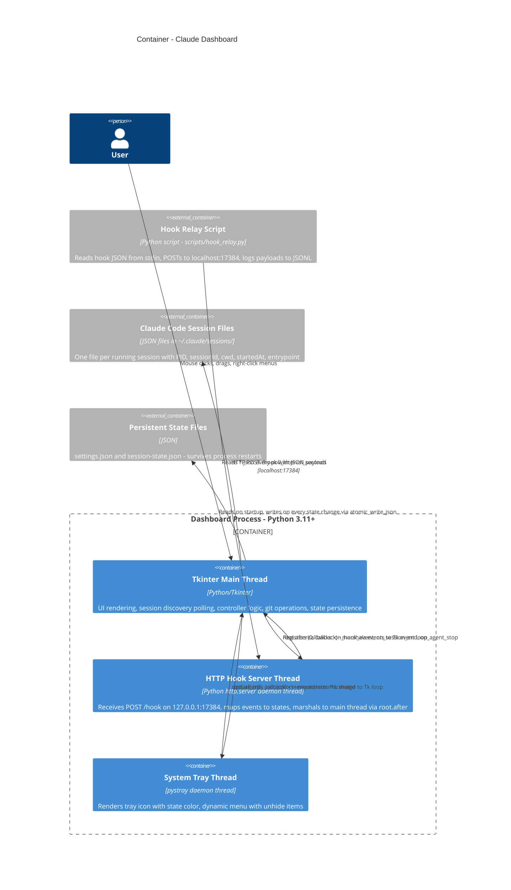

# C4 Container — Claude Dashboard

> Mermaid C4 may not render in all viewers.

## Container Diagram



## Threading and Concurrency Model

The dashboard runs as a single Python process with three threads:

| Thread | Lifecycle | Communication to Main | Notes |
|--------|-----------|----------------------|-------|
| **Tkinter main thread** | Created at startup, runs `root.mainloop()` until quit | N/A (is the main thread) | All UI mutations, session discovery, git operations, and state persistence happen here |
| **HTTP hook server** | Daemon thread, started in `AppController.run()` | `root.after(0, callback)` marshals every event to the Tk event loop | Uses `http.server.HTTPServer` with `SO_REUSEADDR`/`SO_REUSEPORT`; shutdown via `server.shutdown()` with 1s join timeout |
| **System tray** | Daemon thread, started in `AppController.run()` | `root.after(0, callback)` for all menu actions | Uses `pystray.Icon.run()` blocking call; icon image regenerated on main thread, assigned from main thread |

There is no lock or queue — thread safety relies on `root.after(0, fn)` as the sole cross-thread communication mechanism. The hook server thread never mutates session state directly; it always posts a callback to the main thread.

## Data Flow: Hook Event to UI Update

```
Claude Code session
    |
    v
Command hook fires → hook_relay.py reads JSON from stdin
    |
    v
HTTP POST to 127.0.0.1:17384/hook
    |
    v
HookServer thread: _HookHandler.do_POST()
  → parses JSON body
  → map_event_to_state(event, tool_name, agent_id)
  → calls self.server.on_hook_event(session_id, event, state, cwd, agent_id, agent_type)
    |
    v
root.after(0, _apply_hook_state, ...)   [marshals to main thread]
    |
    v
AppController._apply_hook_state() on main thread:
  → looks up PID by session_id (or CWD fallback)
  → if agent_id: registers/updates agent, applies 5s debounce for permission
  → if main process: idle→ready intercept, PostToolUseFailure guard
  → updates entry.state
  → calls _refresh_ui()
    |
    v
_refresh_ui() → debounced (300ms) or immediate (if permission/awaiting_input)
  → builds SessionRow list from all non-hidden entries
  → MainWindow.update_sessions(rows) — adds/removes/reorders row frames
  → updates tray icon color for highest-priority actionable state
  → updates title bar (cost, limits, active count, state color)
  → saves session state to disk
```

## Data Flow: Session Discovery Tick

```
_discovery_tick() fires every poll_interval_seconds (default 3s)
    |
    v
discover_sessions() reads ~/.claude/sessions/*.json
  → filters to entries with pid + session_id
  → sorted by cwd_relative_to_home
    |
    v
For each discovered session:
  → validate_pid() checks psutil.pid_exists + "claude" in process name
  → if new: _add_session() — detect container, branch, git status, apply saved state
  → if known: skip (state updated only via hooks)
    |
    v
Dead PIDs (in _sessions but not in alive set):
  → _remove_session(pid)
  → _create_ghost(cwd, flagged) — synthetic negative PID, unattached=True
    |
    v
On first tick only: _create_unattached_from_state() — ghosts from state file
    |
    v
Prune ghosts whose CWD directory no longer exists on disk
    |
    v
Every ~60s (fetch_tick_interval ticks): git fetch for pushed-not-merged sessions
    |
    v
For all sessions: detect_branch(), detect_git_status(), detect_merged()
  → git status skipped if it takes >0.5s
    |
    v
Every ~30s (poll_interval * 10): read_daily_cost() from session tracker
Every tick: read_usage_limits() from OAuth cache
    |
    v
_refresh_ui()
```
