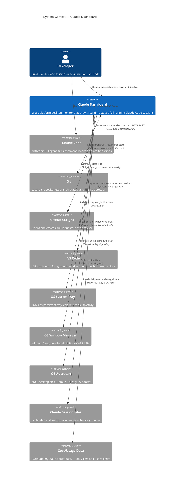

# C4 Context Diagram — Claude Dashboard

## System Context (Level 1)

Shows Claude Dashboard as a single box and every external actor or system it communicates with.



## External Systems Summary

| System | Direction | Protocol | Purpose |
|--------|-----------|----------|---------|
| Claude Code | Inbound | HTTP POST (localhost:17384) | State change events (working, idle, permission, etc.) |
| Session Files | Inbound | File system read | Discover running sessions (PID, CWD, session ID) |
| Cost/Usage Data | Inbound | File system read | Daily cost totals, 5h/7d usage percentages |
| Git | Outbound | Subprocess (read-only) | Branch name, working tree status, merge detection |
| GitHub CLI | Outbound | Subprocess | Open existing PR or create-PR page in browser |
| VS Code | Outbound | Subprocess | Foreground IDE window, launch new sessions |
| OS Window Manager | Outbound | D-Bus / Win32 | Bring terminal/IDE windows to foreground |
| OS System Tray | Outbound | pystray API | Persistent tray icon with state color and menu |
| OS Autostart | Outbound | File / Registry | Register dashboard to start on login |

## Trust Boundaries

```
┌─────────────────────────────────────────────────────────┐
│ Localhost Only                                          │
│                                                         │
│  Claude Code ──stdin──▶ hook_relay.py ──HTTP──▶ Dashboard│
│                                                         │
│  No remote network calls from the dashboard itself.     │
│  GitHub API access is delegated to the `gh` CLI.        │
└─────────────────────────────────────────────────────────┘
```

All dashboard communication is **localhost-only**. The only process that reaches the internet is `gh` (GitHub CLI), invoked as a subprocess for PR operations. The dashboard never makes direct network requests to remote hosts.
