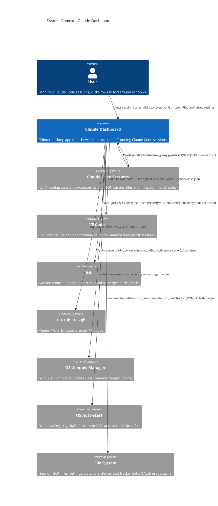

# C4 Context — Claude Dashboard

> Mermaid C4 may not render in all viewers.

## System Context Diagram

## Trust Boundary

Claude Dashboard runs entirely on the local machine. All communication is localhost-only:
- The HTTP hook server binds to `127.0.0.1:17384` — not exposed to the network.
- Hook relay (`hook_relay.py`) runs as a Claude Code command hook in the same user session.
- All file I/O targets `~/.claude/` and platform-specific config directories.

No authentication or authorization is applied to the HTTP endpoint — any local process can POST to port 17384.

## External Systems Summary

| External System | Protocol | Direction | Timeout | Failure behavior |
|----------------|----------|-----------|---------|-----------------|
| Claude Code sessions | File read (`~/.claude/sessions/*.json`) | Dashboard reads | N/A (file I/O) | Missing directory or corrupt JSON: returns empty list |
| Claude Code hooks | HTTP POST to `127.0.0.1:17384` | Hook relay writes, dashboard reads | 2s (relay side) | Relay fails silently; dashboard buffers events for undiscovered sessions |
| VS Code | Subprocess `code <folder>` | Dashboard launches | N/A (Popen, fire-and-forget) | Logs warning if `code` not in PATH |
| Git | Subprocess (multiple read-only commands) | Dashboard invokes | 2s per command, 10s for fetch | Returns None/empty/CLEAN on timeout or error |
| GitHub CLI | Subprocess `gh pr view/create --web` | Dashboard invokes | 10s | Logs warning; FileNotFoundError if gh not installed |
| Win32 API | ctypes calls (EnumWindows, SetForegroundWindow) | Dashboard invokes | N/A (synchronous) | Returns False on failure |
| GNOME Shell D-Bus | Subprocess `gdbus call` via window-calls extension | Dashboard invokes | 3s | Falls back to `code <cwd>` for VS Code, logs debug for terminals |
| OS Auto-start | Windows Registry / XDG .desktop file | Dashboard writes | N/A | Logs warning on failure, no user-visible effect |
| Settings file | JSON at platform-specific path | Dashboard reads/writes | N/A | Returns defaults on read failure; logs error on write failure |
| Session state file | JSON at `~/.claude/claude-dashboard/session-state.json` | Dashboard reads/writes | N/A | Returns empty dict on read failure; logs debug on write failure |
| Cost tracker | JSON files at `~/.claude/my-claude-stuff-data/session-tracker/<date>/*.json` | Dashboard reads | N/A | Returns 0.0 on failure |
| OAuth usage cache | JSON at `~/.claude/my-claude-stuff-data/statusline-cache/oauth_usage.json` | Dashboard reads | N/A | Returns empty dict on failure |
