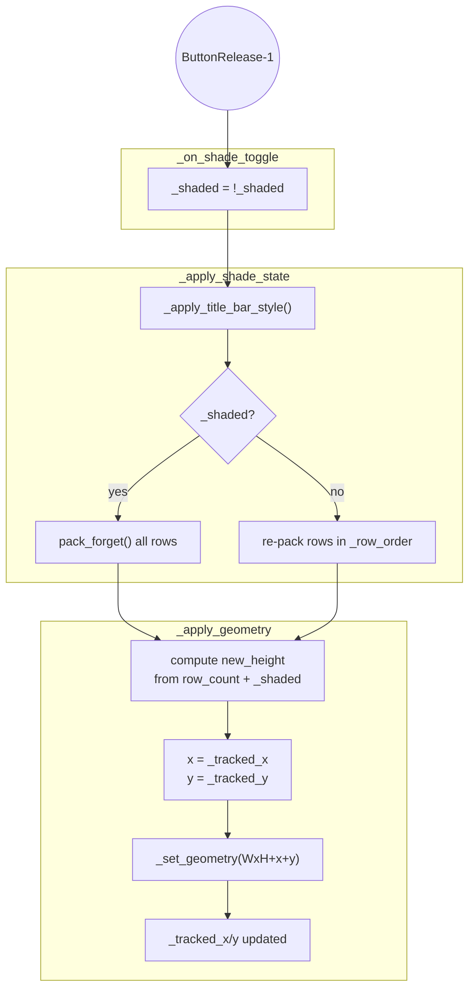
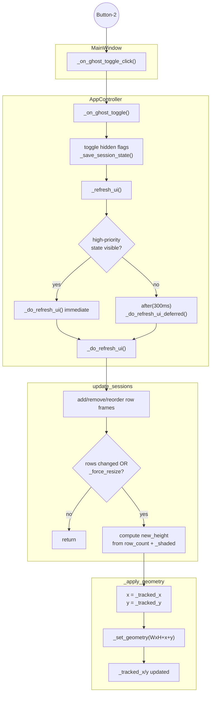

# Title Bar Click Flow Analysis

How left-click (shade) and middle-click (ghost toggle) produce geometry
changes through a shared `_apply_geometry` path.

## Left-Click: Shade Toggle

No controller involvement. Entirely within `MainWindow`.

## Middle-Click: Ghost Toggle

Crosses into `AppController`, returns to `MainWindow` via
`update_sessions`, which calls the same `_apply_geometry`.

## Comparison

| Aspect | Left-click (shade) | Middle-click (ghost toggle) |
|--------|--------------------|-----------------------------|
| Entry point | `_on_shade_toggle` | `_on_ghost_toggle_click` |
| State change | `_shaded` flag (MainWindow) | ghost `hidden` flags (Controller) |
| Row packing | `_apply_shade_state` | `update_sessions` |
| Geometry | `_apply_geometry` | `_apply_geometry` |
| Position source | `_tracked_x/y` | `_tracked_x/y` |
| Synchronous? | Yes | No (300ms debounce) |
