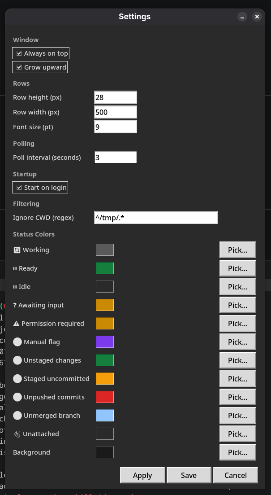

[README](../../README.md) | [Getting Started](getting-started.md) | [Visual Guide](visual-guide.md) | [Session Lifecycle](session-lifecycle.md) | [Interactions](interactions.md) | **Settings**

# Settings

Open the Settings dialog via right-click on the title bar > **Settings**. Changes take effect immediately when you click **Apply** or **Save**.

## Window

| Setting | Default | Description |
|---------|---------|-------------|
| Always on top | On | Keep dashboard above other windows |
| Grow upward | On | Window grows upward from a fixed bottom edge. Title bar sits at the bottom. Good for docking near the bottom of the screen. |

## Rows

| Setting | Default | Description |
|---------|---------|-------------|
| Row height | 28 px | Height of each session row |
| Row width | 500 px | Width of the dashboard window |
| Font size | 9 pt | Base font size |

## Polling

| Setting | Default | Description |
|---------|---------|-------------|
| Poll interval | 3 seconds | How often to check for new or dead sessions |

State updates from hooks arrive in real time regardless of this setting. The poll interval only affects session discovery and git status checks.

## Startup

| Setting | Default | Description |
|---------|---------|-------------|
| Start on login | Off | Launch dashboard automatically on login (XDG autostart on Linux) |

## Filtering

| Setting | Default | Description |
|---------|---------|-------------|
| Ignore CWD (regex) | Empty | Regex pattern matched against session working directory. Matching sessions are excluded entirely — they don't appear in the dashboard or menus. |

The regex uses Python's `re.match()`, which anchors to the start of the string. Leave empty to show all sessions.

## Status Colors

Click the color swatch to open the color picker. Each row in the dashboard uses the color matching its current state.

| Label | Description |
|-------|-------------|
| Working | Row color when Claude is actively processing |
| Ready | Row color when Claude has finished |
| Idle | Row color when waiting for user input |
| Awaiting input | Row color when Claude is asking a question |
| Permission required | Row color when a tool needs approval |
| Manual flag | Eye icon pupil color when manually flagged (middle-click) |
| Unstaged changes | Eye icon color for modified files not yet staged |
| Staged uncommitted | Eye icon color for staged but uncommitted changes |
| Unpushed commits | Eye icon color for commits not pushed to remote |
| Unmerged branch | Eye icon color for pushed branches without a merged PR |
| Unattached | Row color for ghost (previous) sessions |
| Background | Window background color |

Text color on each row is computed automatically for contrast — you only pick background colors.

## Color Picker

The color picker dialog includes:

- A palette grid of preset colors
- A hex entry field for precise values
- A live preview showing the selected color

The picker remembers its position between uses.

## Settings File

Settings persist to a JSON file that is managed by the dialog. You don't normally need to edit it directly.

- **Linux**: `~/.config/claude-dashboard/settings.json`
- **Windows**: `%APPDATA%\claude-dashboard\settings.json`
