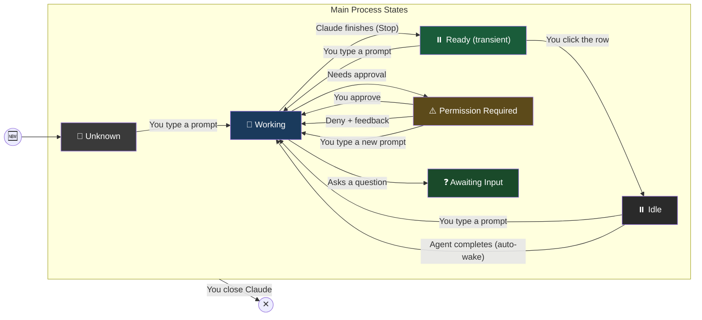
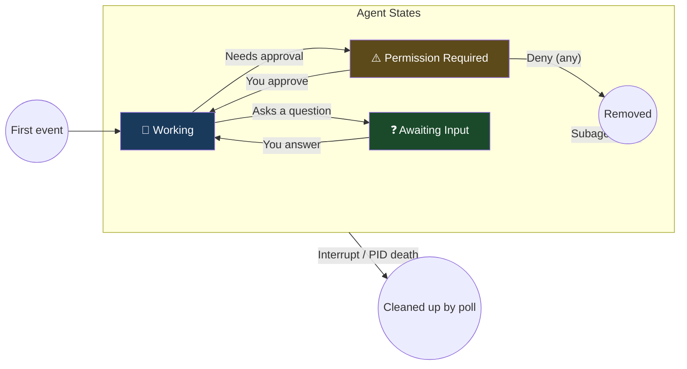

# Session States

## Main Process State Machine



## Agent State Machine

Agents have a simpler lifecycle — they never receive `Stop`, never enter Ready/Idle.



## Effective (Displayed) State

The session row shows the **highest priority state** across the main process and all active agents:

```text
effective_state = max_priority(main_state, agent_1_state, agent_2_state, ...)
```

| Priority | State | Meaning |
|----------|-------|---------|
| 1 (highest) | Permission Required | Something is blocked waiting for approval |
| 2 | Awaiting Input | Something asked a question |
| 3 | Ready | Main process finished (no agents blocking) |
| 4 | Working | Something is actively processing |
| 5 | Idle | Nothing happening |
| 6 (lowest) | Unknown | No hook events received yet |

Examples:

- Main=Idle, 1 agent=Working → display **Working**
- Main=Idle, 1 agent=PermissionRequired → display **PermissionRequired**
- Main=Working, 1 agent=PermissionRequired → display **PermissionRequired**
- Main=Ready, no agents → display **Ready**
- Main=Idle, no agents → display **Idle**

## States

| State | Emoji | Color | What It Means |
|-------|-------|-------|--------------|
| Unknown | 🤷 | Dark gray (#3a3a3a) | Dashboard hasn't seen any activity from this session yet |
| Working | 🔄 | Blue (#1a3a5c) | Something is active — main process or an agent is processing |
| Ready | ⏸️ | Green (#1a5c3a) | Main process just finished and no agents are blocking. Persists until you click the row. |
| Idle | ⏸️ | Gray (#2a2a2a) | Nothing happening. Ball is in your court |
| Awaiting Input | ❓ | Green (#1a4a2a) | Something asked you a question and is waiting for your answer |
| Permission Required | ⚠️ | Orange (#5c4a1a) | Something wants to run and needs your approval |

## Tray Icon Priority

The system tray icon color reflects the most urgent state across all **visible** sessions (hidden sessions excluded):

1. **Orange** — at least one session needs permission
2. **Green** — at least one session is asking you a question
3. **Green (darker)** — at least one session is in Ready state (just finished)
4. **Blue** — at least one session is working
5. **Gray** — everything is idle or unknown

## Agent Lifecycle

### Registration

`SubagentStart` is **unreliable** — it sometimes does not fire for background agents. Agents are registered on the first hook event carrying an `agent_id` that is NOT `SubagentStop`. If `SubagentStop` is the first and only event seen for an `agent_id`, the agent is already done — do not register it.

### Removal

Agents are removed on `SubagentStop`. After removal, Claude Code auto-fires a `UserPromptSubmit` → `Stop` cycle on the main session to process the agent's result (one cycle per completed agent).

### Agent Clearing

All tracked agents for a session are cleared when:
1. **`UserPromptSubmit` arrives (no `agent_id`)** — new user turn. Any agents from prior turns are wiped. If a cleared agent fires a hook later, it is re-registered as new.
2. **Parent session PID dies** — detected by discovery poll, removes session and all its agents.

This handles orphaned agents from interrupts (no `SubagentStop` fires) without timeouts or TTLs.

### Agent Types

The `agent_type` field is present on all agent hook events. Observed value: `"general-purpose"`. May expand as Claude Code adds specialized agent types.

## What Won't Update

- **Dashboard starts after sessions are already running** — rows show Unknown until the next interaction
- **Main process interrupted (Ctrl+C/Escape)** — no hook fires; state stays at last value until next interaction or PID death
- **Permission denied without feedback (main process)** — no follow-up hook fires; state stays at PermissionRequired until the user sends a new prompt (`UserPromptSubmit`)

## Implementation Notes

### Ready state

When a `Stop` hook event arrives (without `agent_id`), the controller intercepts the IDLE transition and sets the main state to READY instead. Ready persists until the user clicks the row (clears to IDLE) or new activity arrives (back to WORKING).

### Auto-wake after agent completion

Each `SubagentStop` triggers an automatic `UserPromptSubmit` → `Stop` on the main session. With N background agents, expect up to N such cycles. These are NOT user-initiated — they're Claude processing agent results. The dashboard handles them as normal state transitions (WORKING briefly, then READY).

### Deny without feedback (main process)

Research (Test 8, 2026-03-24) confirmed: denying a tool on the main process without feedback text fires NO follow-up hook. No `PostToolUse`, no `Stop`. State remains at PermissionRequired until the user sends a new prompt. Known gap, no workaround.

### Deny without feedback (agent)

Agent permission denial (with or without feedback) fires `SubagentStop` — the agent gives up cleanly. No stuck state.

### Out-of-order agent completion

Agents can complete in any order regardless of when they started. The dashboard must handle interleaved `SubagentStop` → auto-wake cycles from multiple agents.

### Session crash

When Claude crashes, no `SessionEnd` hook fires. The discovery poll detects the dead PID within one poll cycle (default 5 seconds) and removes the row. All tracked agents for that session are also cleaned up.

### Resumed sessions

When a session is resumed, hooks may fire with the original session ID rather than the new one. The dashboard matches by CWD as a fallback.

## UI Interactions

### Row Context Menu (Right-Click)

Right-clicking a session row opens a context menu with:
- **Hide** — hides the session from the dashboard (transient, not persisted)
- **Clear agents** — visible only if the session has active agents; clears all tracked agents
- **Flag** / **Unflag** — toggles the flag state (sticky, survives restart via state persistence)

The context menu auto-dismisses after 3 seconds (`_CONTEXT_MENU_TIMEOUT_MS`).

### Flag Indicator

Flagged sessions display a colored dot (⬤) to the left of the container label. The dot color reflects git working tree status (see Git Status Flags below) and is configurable via `color_flag_*` settings. Flag state is sticky — only middle-click or the context menu toggles it; left-click does not clear the flag.

Flag state persists across dashboard restarts via `~/.claude/claude-dashboard/session-state.json`.

### Tray Icon Menu

The tray icon right-click menu is fully dynamic:
- **Show** / **Hide** — toggles dashboard visibility
- **Unhide: (session)** — one item per hidden session (flat list, no submenus due to pystray limitations on Linux)
- **Settings** — opens settings dialog
- **Quit** — exits the dashboard

## Colors and Emojis

All colors and emojis are configurable in Settings (accessible via tray icon right-click → Settings).
