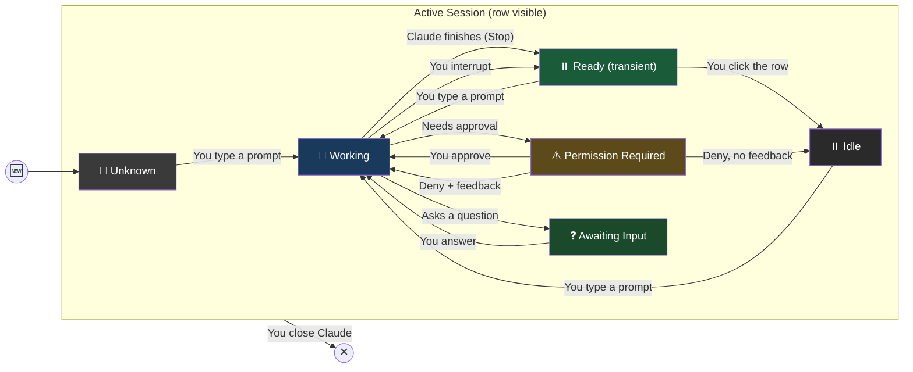

# Session States

## State Machine

## States

| State | Emoji | Color | What It Means |
|-------|-------|-------|--------------|
| Unknown | 🤷 | Dark gray (#3a3a3a) | Dashboard hasn't seen any activity from this session yet |
| Working | 🔄 | Blue (#1a3a5c) | Claude is doing something — processing your prompt, reading files, running commands |
| Ready | ⏸️ | Green (#1a5c3a) | Claude just finished. Persists until you click the row to acknowledge. New activity goes back to Working. |
| Idle | ⏸️ | Gray (#2a2a2a) | Claude finished a while ago. Ball is in your court |
| Awaiting Input | ❓ | Green (#1a4a2a) | Claude asked you a question and is waiting for your answer |
| Permission Required | ⚠️ | Orange (#5c4a1a) | Claude wants to run something and needs your approval |

## Tray Icon Priority

The system tray icon color reflects the most urgent state across all sessions:

1. **Orange** -- at least one session needs permission
2. **Green** -- at least one session is asking you a question
3. **Green (darker)** -- at least one session is in Ready state (just finished)
4. **Blue** -- at least one session is working
5. **Gray** -- everything is idle or unknown

## What Won't Update

- **Dashboard starts after sessions are already running** -- rows show Unknown until the next interaction in each session
- **Subagents working in background** -- main session may show Idle while agents are active (future enhancement)

## Implementation Notes

### Ready state

When a `Stop` hook event arrives, the controller intercepts the IDLE transition and sets the state to READY instead. Ready persists indefinitely until the user clicks the row, which clears it to IDLE. If new activity arrives (any hook event), the state goes back to WORKING.

The Ready state exists so users can notice when Claude finishes -- the color change from Working (blue) to Ready (green) is visually distinct and persists until acknowledged. Clicking the row clears the indicator so it does not compete with other Ready sessions the user hasn't checked yet.

### Interruption gap

The desired transition is **Working -> Ready** when you interrupt Claude. No hook event fires on interruption. The dashboard keeps showing Working until the next interaction. Known v0.1 limitation.

### Deny without feedback gap

The desired transition is **PermissionRequired -> Ready** when you deny a tool without providing feedback text. Claude stops and waits for the next prompt. However, a `PostToolUse` hook fires (with the denial result), which maps to Working, followed by a `Stop` which maps to Ready. The intermediate Working flash is brief but may be visible.

### Session crash

When Claude crashes, no `SessionEnd` hook fires. The discovery poll detects the dead PID within one poll cycle (default 5 seconds) and removes the row.

### Resumed sessions

When a session is resumed, hooks may fire with the original session ID rather than the new one. The dashboard matches by CWD as a fallback.

## Colors and Emojis

All colors and emojis are configurable in Settings (right-click -> Settings).
