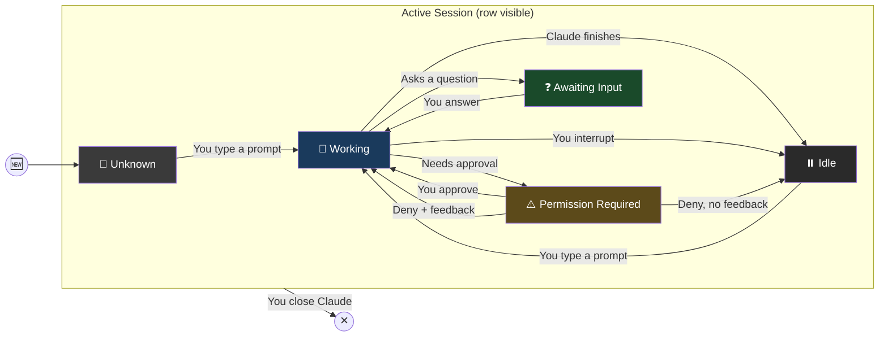

# Session States

## State Machine

## States

| State | Emoji | Color | What It Means |
|-------|-------|-------|--------------|
| Unknown | 🤷 | Dark gray | Dashboard hasn't seen any activity from this session yet |
| Working | 🔄 | Blue | Claude is doing something — processing your prompt, reading files, running commands |
| Idle | ⏸️ | Gray | Claude finished. Ball is in your court |
| Awaiting Input | ❓ | Green | Claude asked you a question and is waiting for your answer |
| Permission Required | ⚠️ | Orange | Claude wants to run something and needs your approval |

## Tray Icon Priority

The system tray icon color reflects the most urgent state across all sessions:

1. **Orange** — at least one session needs permission
2. **Green** — at least one session is asking you a question
3. **Blue** — at least one session is working
4. **Gray** — everything is idle or unknown

## What Won't Update

- **Dashboard starts after sessions are already running** — rows show Unknown until the next interaction in each session
- **Subagents working in background** — main session may show Idle while agents are active (future enhancement)

## Implementation Notes

### Interruption gap

The desired transition is **Working → Idle** when you interrupt Claude. No hook event fires on interruption. The dashboard keeps showing Working until the next interaction. Known v0.1 limitation.

### Deny without feedback gap

The desired transition is **PermissionRequired → Idle** when you deny a tool without providing feedback text. Claude stops and waits for the next prompt. However, a `PostToolUse` hook fires (with the denial result), which maps to Working, followed by a `Stop` which maps to Idle. The intermediate Working flash is brief but may be visible.

### Session crash

When Claude crashes, no `SessionEnd` hook fires. The discovery poll detects the dead PID within one poll cycle (default 5 seconds) and removes the row.

### Resumed sessions

When a session is resumed, hooks may fire with the original session ID rather than the new one. The dashboard matches by CWD as a fallback.

## Colors and Emojis

All colors and emojis are configurable in Settings (right-click → Settings).
